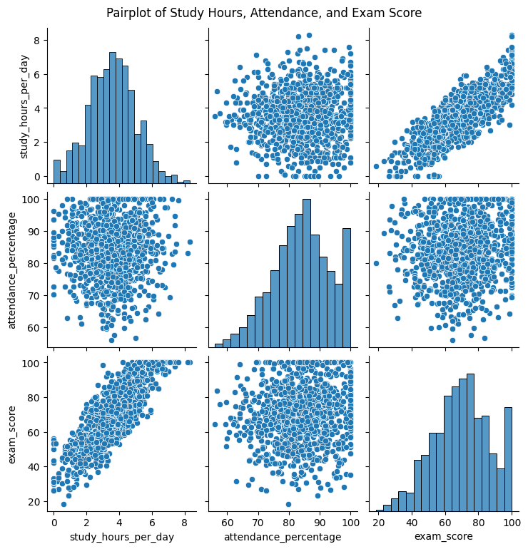

# 🎓 Student Score Predictor 🎓

A simple project that uses machine learning to predict a student's final exam score based on their study habits!

---

### 🎯 Project Goal

The main question to be answer is:

> **Can we predict a student's final exam score using the hours they study per day and their class attendance percentage?**

I'll build a simple but smart computer model to find out!

---

### 📂 Project Structure

Here's how the project files are organized:

└── student-score-prediction/
    
    ├── 📄 README.md                           # You are here!
    ├── 📄 requirements.txt                    # Project dependencies
    ├── 📁 sample_dataset/                     # Holds the raw dataset
        └──student_performance_dataset.csv          # The dataset used in the project
    ├── 📁 notebooks/                          # Jupyter Notebooks for exploration
        └── 📄 data_
    ├── 📁 src/                                # Main Python code
        ├──
        └──
    └── 📁 visualizations/        # Saved plots and charts
        ├──
        └──

---

### 📊 About the Dataset

The dataset for this project is called `student_performance_dataset.csv`. It has a lot of interesting information, but to keep things focused, I only used three columns:

* **`study_hours_per_day`**: How many hours a student studies daily.
* **`attendance_percentage`**: The student's class attendance.
* **`exam_score`**: The final score they got (this is what I tried to predict).

---

### ⚙️ How It Works

I followed a few key steps to get from the raw data to a final prediction:

1.  **Loading the Data**: First, I wrote a script to load the CSV file using the pandas library.
2.  **Making Charts**: I used matplotlib and seaborn to create some plots. This was the most interesting part because I could actually *see* that students who studied more and had better attendance generally got higher scores. This gave me confidence that a model would work.
3.  **Training the Model**: This was the core machine learning part. I used an algorithm called Linear Regression. I split my data, using 80% to "teach" the model and the other 20% to test it.
4.  **Making a Prediction**: After training, I used the model to predict a score for a made-up student to see it in action.

---

### 🚀 Getting Started

Want to run this project on your own computer? Just follow these simple steps!

1.  **Clone the Repository**
    Open your terminal and run this command:
    ```bash
    git clone <your-github-repo-link>
    cd student-score-prediction
    ```

2.  **Install the Magic Tools (Libraries)**
    This project needs a few Python libraries to work. Install them all with one command:
    ```bash
    pip install -r requirements.txt
    ```

3.  **Run the Predictor!**
    Execute the main script to see the magic happen:
    ```bash
    python src/model_training.py
    ```
    The results will be printed directly in your terminal.

---

### 📈 What I Found Out

After running the model, here’s what we found out:

#### **Visual Insights**

The charts show a clear positive relationship: the more a student studies and attends class, the higher their exam score tends to be.

*(Note: Make sure the `visualizations` folder with the images is in the same directory as this README for the images to show up on GitHub.)*

| Pairplot of Relationships | Correlation Heatmap |
| :-----------------------: | :-------------------: |
|     |  |

#### **Model Performance**

* **R-squared (R²)**: **0.6623**
    * **In simple terms**: This means that **66%** of the differences in student exam scores can be explained by their study hours and attendance. That's pretty good!

* **Mean Absolute Error (MAE)**: **7.4299**
    * **In simple terms**: On average, the model's predictions are off by about **7.4 points**. So, if it predicts a score of 80, the actual score could be anywhere from ~73 to ~87.

#### **Final Prediction 🔮**

For a student who studies **4 hours per day** and has **80% attendance**, our model predicts an exam score of:

## **73.39**

---

### 🤔 Thinking Ethically

It's important to remember that this model is a simplified tool.
* **It's Not a Crystal Ball**: Student success is complex! Factors like sleep, mental health, and teaching quality also play a huge role, which our model doesn't consider.
* **Data Has Limits**: The data we used might not represent every type of student.
* **Fairness First**: This tool should **only** be used for learning and insight, **never** to make real-life decisions about a student's future.

Thanks for checking out my project!

---